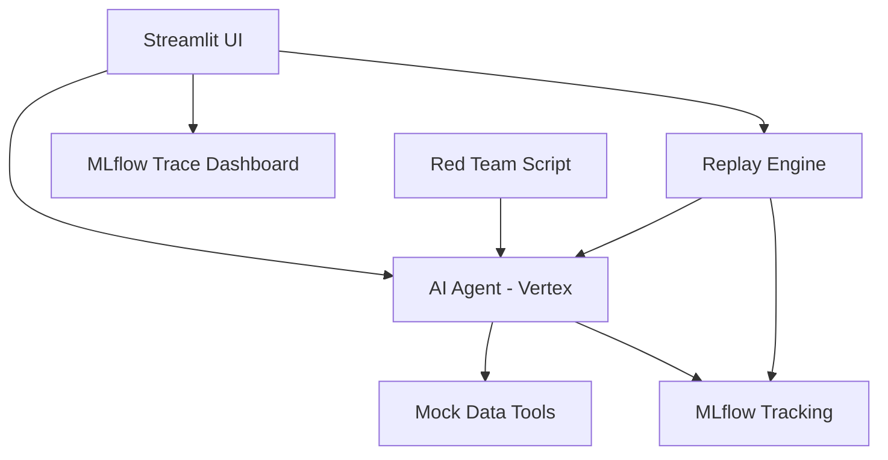

# AI Flight Recorder for Agentic AI

**Live Demo:** [https://ai-flight-recorder-943799980636.us-central1.run.app/](https://ai-flight-recorder-943799980636.us-central1.run.app/)

> Trace what happened. Evaluate what went wrong. Replay with a better prompt. Govern what reaches production.

This project implements a web-based "flight recorder" for an AI agent built on three core pillars:
1. **Not just logging → diagnosis + replay:** We trace the exact agent execution and allow users to actively replay, tweak, and debug exactly past runs side-by-side.
2. **Not just observability → actionable improvement:** We use exclusive MLflow evaluation and an automated red team to structurally improve the agent's reliability.
3. **Not just experiment tracking → agent-level trace intelligence:** We rely on MLflow to deliver a dedicated Trace Dashboard, revealing reasoning, tool calls, and failure classifications.

### MLflow 3.12 Highlights Demonstrated
- **Multimodal Tracing:** Attach and view PDFs in the trace view natively.
- **PromptOps & Lineage:** End-to-end integration mapping traces back to MLflow Prompt Registry aliases.
- **Trace Graph View:** Debug complex agent logic using the interactive graph visualization in the MLflow UI.
- **Native OpenTelemetry GenAI Semantic Conventions:** Configured natively to capture metrics.

## Architecture


## Setup & Demo (Under 5 Minutes)

1. **Install Dependencies**
   ```bash
   pip install -r requirements.txt
   ```
2. **Run the Red Team Reliability Tester**
   This populates the MLflow database with initial edge-case traces, failure classifications, and tests the exactly 2-try limit.
   ```bash
   python -m src.red_team
   ```
3. **Start the Flight Recorder UI**
   ```bash
   streamlit run app.py
   ```
4. **Demo Flow**:
   - Go to the **Query** tab and run a test.
   - Switch to the **Trace Dashboard** to see the MLflow traces.
   - Switch to the **Replay & Comparison** tab. Select the past run, change the prompt version, and replay it to see the side-by-side execution comparison (strictly restricted to 2 runs).

## Future Evolution
To evolve this into an enterprise-grade observability product:
- **Native MLflow Tracing UI Integration:** Embed the actual MLflow Trace UI iframe directly into the Streamlit app.
- **Continuous Evaluation:** Run `mlflow.evaluate` automatically on a schedule for all trace logs from production.
- **Production Routing:** Use failing traces to fine-tune a smaller, cheaper open-source SLM to replace the heavier Gemini model for common sub-tasks.
